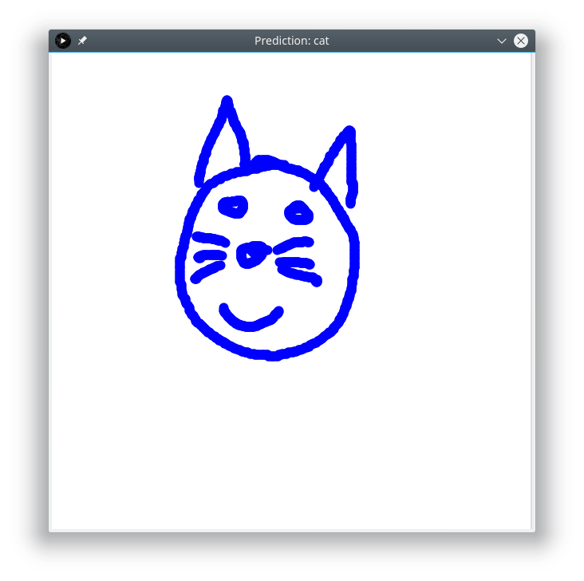

# doodledetect

A simple doodle detection program that uses a convolutional neural network to detect several different objects/animals.

It is based on:
- [Processing](https://processing.org/) for the UI and user interaction.
- Data from Google's [QuickDraw](https://quickdraw.withgoogle.com/data) experiment used under the [Creative Commons Attribution 4.0 International license](https://creativecommons.org/licenses/by/4.0/).
- [Keras](https://keras.io/) with the [Tensorflow](https://www.tensorflow.org/) CUDA backend for the neural network modelling and training in Python.
- [DL4J](https://deeplearning4j.org/index.html) for loading and using the pre-trained model from Java.

